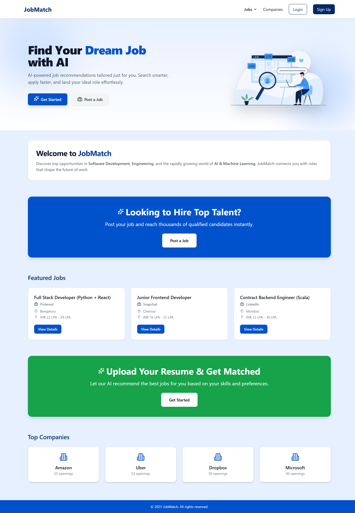
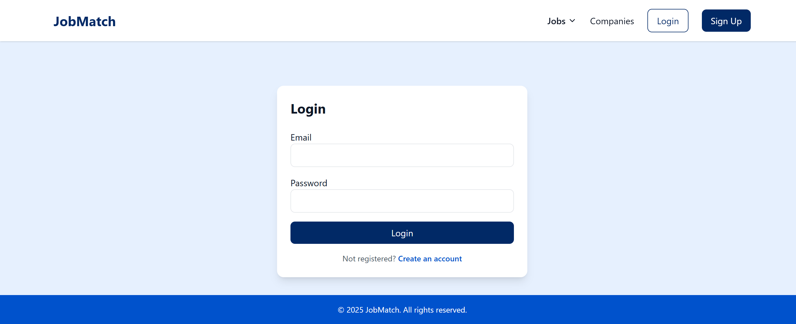
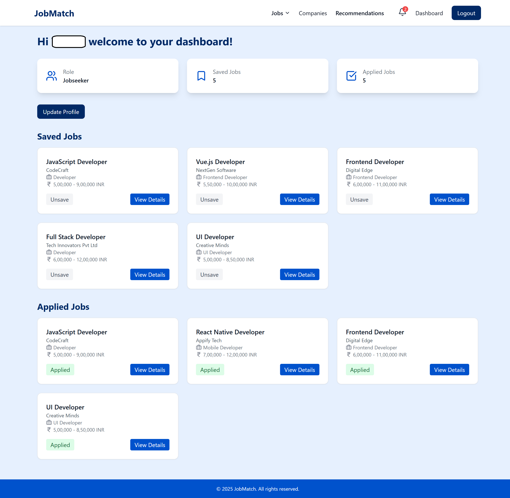

#JobMatch

JobMatch is a job portal that connects job seekers with recruiters seamlessly. It provides features like job recommendations, notifications, job applications, and recruiter tools for posting jobs. Built with MERN stack and integrated with Socket.io for real-time notifications.

## Features

### Job Seeker
- View all jobs with filters and search options
- Job recommendations
- Save and apply to jobs
- Real-time notifications for new jobs or updates
- Dashboard showing applied and saved jobs

### Recruiter
- Post and manage jobs
- View applicants
- Pricing plans for premium features

### Admin
- Manage users and jobs
- Monitor platform activities

### Common
- Responsive UI with TailwindCSS
- Authentication & role-based access
- Real-time notifications with Socket.io
- Error handling with custom 404 & 500 pages

## Tech Stack
- Frontend: React, TailwindCSS, Lucide Icons, Framer Motion
- Backend: Node.js, Express
- Database: MongoDB (Atlas)
- Real-time: Socket.io
- Authentication: JWT

## Project Setup

### 1. Clone the repository
git clone https://github.com/yourusername/jobmatch.git
cd jobmatch

### 2. Backend Setup
cd backend
npm install

Create a .env file with the following variables:
- PORT=5000
- MONGO_URI=your_mongodb_connection_string
- JWT_SECRET=your_jwt_secret

Run the server:
- npm run dev

Server runs at http://localhost:5000

### 3. Frontend Setup
- cd frontend
- npm install
- npm run dev

Frontend runs at http://localhost:5173

## Environment Variables

### Backend
- PORT – server port (default: 5000)
- MONGO_URI – MongoDB connection string
- JWT_SECRET – secret key for JWT

### Frontend
- .env variables can include API URLs if needed, e.g.,
- VITE_API_URL=http://localhost:5000

## API Endpoints

### Auth
- POST /api/auth/login – login
- POST /api/auth/signup – signup

### Jobs
- GET /api/jobs – get all jobs
- POST /api/jobs – post a job (recruiter)
- GET /api/jobs/:id – get job details

### Applications
- GET /api/applications – get applied jobs
- POST /api/applications – apply to a job

### Notifications
- GET /api/notifications – fetch user notifications
- PUT /api/notifications/:id/read – mark as read

### Saved Jobs
- GET /api/saved-jobs – get saved jobs
- DELETE /api/saved-jobs/:id – unsave job

## Usage
- Signup as a Job Seeker or Recruiter
- Login to access dashboard and features
- Job seekers can browse jobs, save, and apply
- Recruiters can post jobs and view applicants
- Notifications are real-time via Socket.io

## Screenshots

### 1. Home & Navigation

### 2. Authentication Pages

### 3. Job Listings & Details

### 4. Jobseeker Dashboard & Features

### 5. Recruiter/Admin Dashboard & Management

## Contributing
- Fork the repository
- Create your feature branch: git checkout -b feature/feature-name
- Commit your changes: git commit -m 'Add some feature'
- Push to branch: git push origin feature/feature-name
- Open a Pull Request

## License
- MIT License © 2025